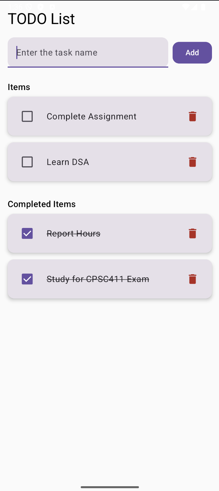
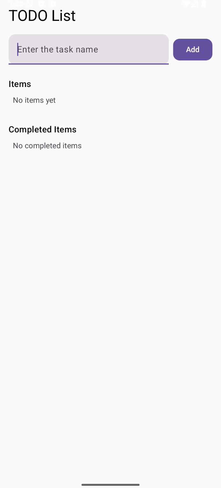

# 📋 To-Do App (Jetpack Compose)

## 🚀 Overview
This is a simple, polished **To-Do List app** built using **Jetpack Compose**.  
The app allows users to add tasks, mark them as completed, move them back to active, and delete them.  
It demonstrates **data classes, state management, state hoisting, recomposition, and clean Compose layouts**.

---

## ✨ Features
- ➕ **Add New Task** with TextField + Button
- ❌ **Delete Tasks** individually
- ✅ **Mark Tasks as Completed/Uncompleted** with a checkbox
- 📂 **Active & Completed Sections** with headers
- 📭 **Empty State Messages** when no tasks are present
- 🔄 **Config Change Persistence** (`rememberSaveable` for text input)
- 🎨 **Modern Material 3 UI** with cards, rounded components, and spacing

---

## 🛠️ Concepts Used
- **Data Class** → `TodoItem` for modeling tasks
- **State Management** → `mutableStateListOf`, `remember`, `rememberSaveable`
- **State Hoisting** → `TodoRow` composable is stateless, parent handles logic
- **Compose Layouts** → `Row`, `Column`, `TextField`, `Button`, `Checkbox`, `IconButton`, `Card`
- **Recomposition** → Updates only the changed task
- **Unidirectional Data Flow** → Parent (`ToDoApp`) manages state, children (`TodoRow`) receive events

---

## 📸 Screenshots
| Active & Completed Items | Empty States |
|--------------------------|--------------|
|  |  |


---

## 📂 Project Structure
app/
└── src/
└── main/
└── java/
└── com/
└── example/
└── todoappcompose/
├── MainActivity.kt # UI + Logic
└── TodoItem.kt # Data class

---

## ▶️ How to Run
1. Clone this repo:
   ```bash
   git clone https://github.com/IndrayaniBhosale/ToDoAppCompose.git
Open in Android Studio (Arctic Fox or newer).
Build & Run on emulator or physical device.

---

## 📖 Learning Objectives Achieved
- Model UI data with data classes
- Manage state with Compose state APIs
- Apply state hoisting for reusable UI
- Use Material 3 components for clean layouts
- Understand recomposition and data flow

---

## 📌 Author
Built by Indrayani Bhosale for Fall 2025 – CPSC 411A-02 (17521) Mobile Device Application Programming for Android.
